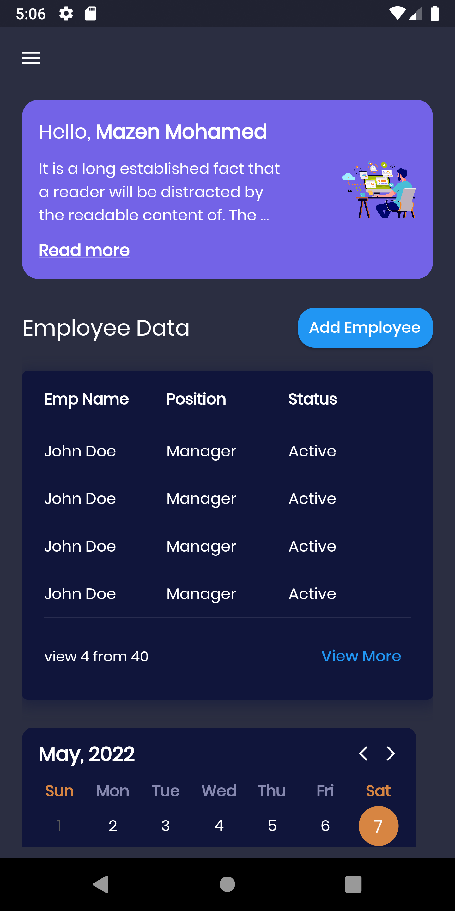

# Dashboard

Responsive Dashboard adapts your UI to different screen sizes automatically. 

## Features

- Awesome UI
- Responsive design for all devices
- [Live Preview](https://mazen-mo7amed.github.io/host_dashboard/#/)

## ✌ PPreview:

|   Device   |                    Preview                    |                    Preview                    |
|:----------:|:---------------------------------------------:|:---------------------------------------------:|
|  **Web**   |  |  |
|  **Web**   |  |
| **Tablet** |  |  | 
| **Mobile** |  |  |                                                                  

